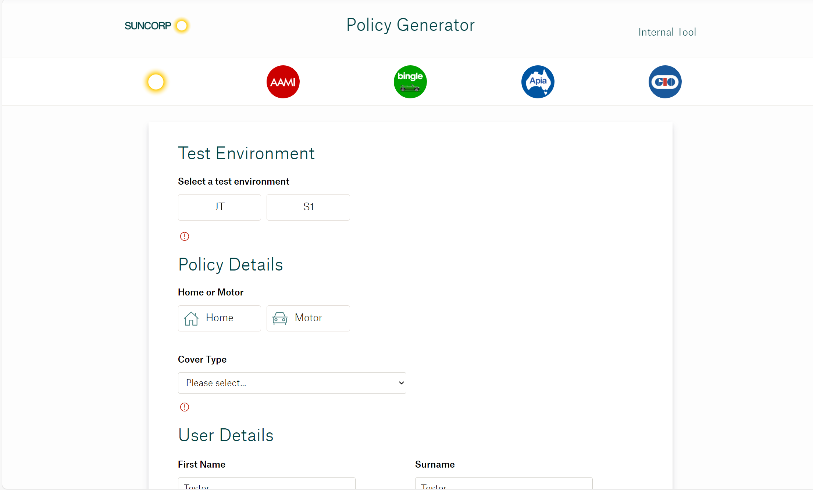

### Hi there 👋

#### About Me

- Finishing a Bachelor of Computer Science 🎓
- Passionate about web and mobile development 💻
- Interested in AR/VR and spatial computing 👀

#### Current Projects

- [OnTrack LMS](https://github.com/doubtfire-lms/doubtfire-deploy) - integrating the new Numbas feature - `Angular` `TypeScript` `Tailwind CSS` `Ruby on Rails` `Docker`
- [todo-app](https://github.com/satikaj/todo-app) - experimenting with back-end development - `Nest.js` `Node.js` `TypeScript`

#### Previous Projects

- _Policy Generator_ - internal testing tool for Suncorp composed of a UI and Experience API - `React` `Java Spring Boot` `OpenShift` `Jenkins` `Artifactory`

